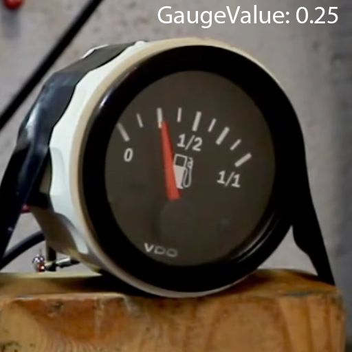

# Gauge Reading

The goal of this project is to develop a pipeline capable of training a CNN (Convolutional Neural Network) to predict the normalized position of a gauge's pointer as a single floating-point number between 0 and 1. 

Here are some examples of input images and expected outputs produced by the network in the top-right corner

# File structure

Inside this repo, you will find a `datasets` folder containing two datasets, one for validation and another for training purposes. Each dataset is comprised of a set of images inside the `Data` folder with their corresponding annotations in a `.json` file with the same name under the `Annotations`  folder. Each image contains a single bounding box for the gauge, which should be extracted as a crop during training/inference (remember, you are training a classifier, not a detector).

# Annotation format

Each `.json` file in the validation/training folders contains an `annotation` array with bounding boxes for each gauge in the image. You should expect every image to contain a single bounding box. Each bounding box contains a `bbox` field with the corner coordinates and a `class_values` with the pointer normalized position (between 0 and 1) as the first element.

# Restrictions

* Please make sure to use `Pytorch` as the Deep learning framework.
* Don't modify the training/validation datasets in any way (except for augmentations of course)

# Expected outcome

We expect to find a `train.py` script that will be responsible for training the network and saving checkpoints to disk and a `test.py` to produce inference results (showing the original image and the predicted value) for a given checkpoint.

There are a lot of things to consider, such as the loss function, network architecure, augmentations, evaluation metrics, etc, which we will leave up to you. **Please be sure to document your tought process as much as possible in a separate `.md` file.**

Code structure and usage instructions will be taken into account when evaluating the solution, so be sure to keep that in mind.

The resulting project should be delivered as a `zip` file to the designated recipient. Please do not fork.

